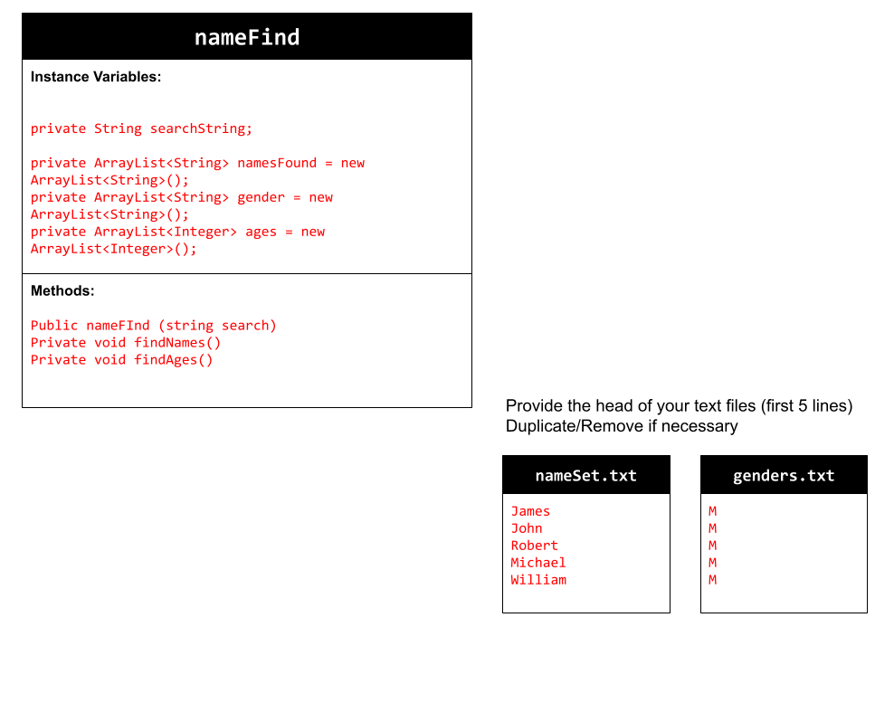
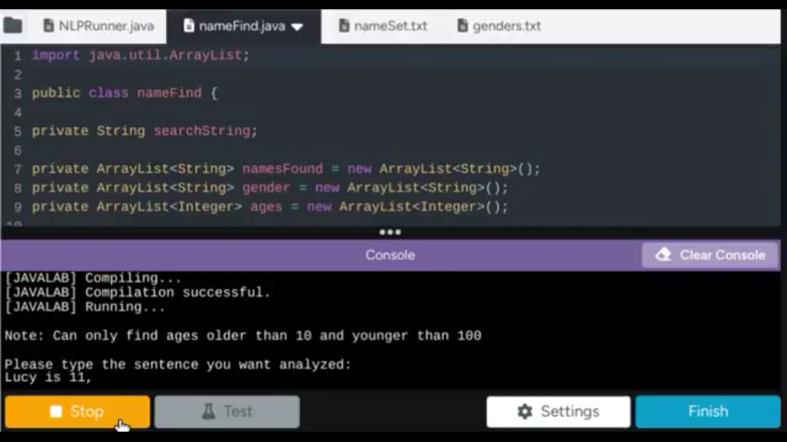

# Unit 6 - Natural Language Processing Project

## Introduction

Natural language processing (NLP) is used in many apps and devices to interact with users and make meaning of text to determine how to respond, find information, or to create new text. Your goal is to use natural language processing techniques to identify structure, patterns, and meaning in a text to have conversations with a user, execute commands, perform manipulations on the text, or generate new text.

## Requirements

Use your knowledge of object-oriented programming, ArrayLists, the String class, and algorithms to create a program that uses natural language processing techniques:

- **Create at least two ArrayLists** – Create at least two ArrayLists to store the data used in your program, such as data from text files or entered by the user.
- **Implement one or more algorithms** – Implement one or more algorithms that use loops and conditionals to find or manipulate elements in an ArrayList or String object.
- **Use methods in the String classs** - Use one or more methods in the String class in your program, such as to divide text into sentences or phrases.
- **Use at least one natural language processing technique** – Use a natural language processing technique to process, analyze, and/or generate text.
- **Document your code** – Use comments to explain the purpose of the methods and code segments and note any preconditions and postconditions.

## UML Diagram

## Video

## Project Description

In this project I wanted to create a program that could analyze a sentence or multiple sentences for a specific/objective characteristic (not something like nouns which can vary). I decided on names because I knew I could use sentence structure or datasets of popular names to allow my program to function correctly majority of the time. My program iterates through my dataset of names and searches to see if that name is found in the user-inputted sentence.

## NLP Techniques
My project uses Named-Entity Recognition (NER) to identify all names located in the user-inputted text. My findNames() method  uses NER to located names that match my dataset. My findAges() method also uses a variation of NER, however, rather than searching nouns or names it searches for numbers in the text.